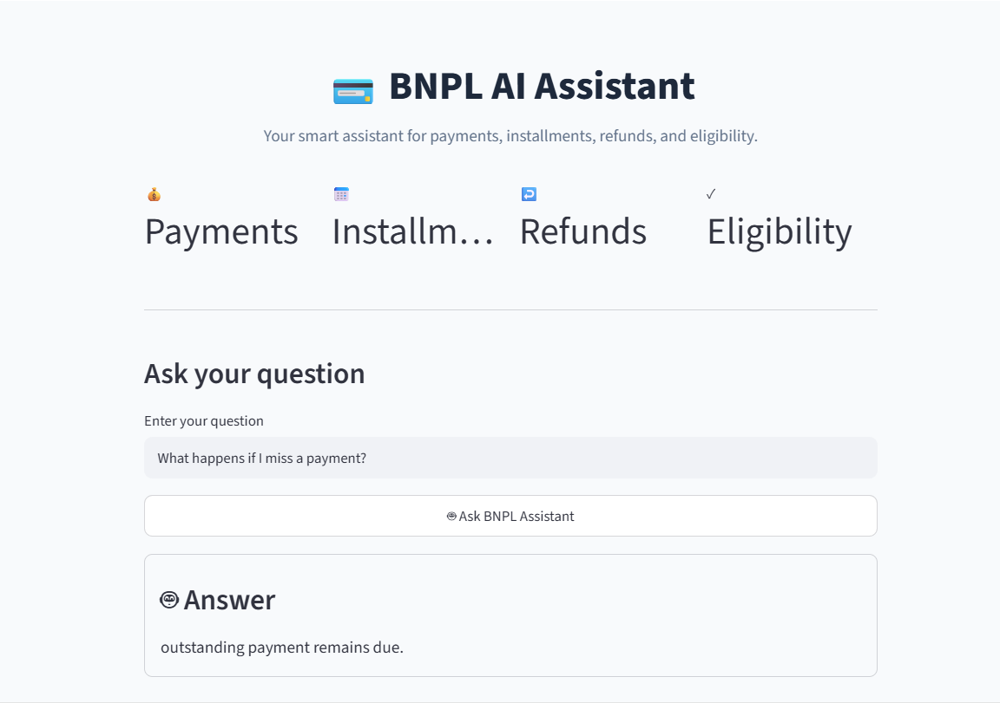

# BNPL AI Assistant

An AI-powered customer support assistant for Buy Now, Pay Later (BNPL) services.

This project uses Retrieval-Augmented Generation (RAG) to retrieve relevant information from a BNPL knowledge base and generate concise, customer-friendly answers.

## Project Overview

The BNPL AI Assistant is designed to answer common customer questions related to:

- Payments
- Installments
- Refunds
- Eligibility
- Late payments

The system retrieves relevant information from a predefined knowledge base before generating an answer, helping reduce unsupported or hallucinated responses.

## Architecture

User Question
      ↓
Streamlit UI
      ↓
Query Embedding
      ↓
FAISS Vector Search
      ↓
Relevant Knowledge Chunks
      ↓
Prompt + Context
      ↓
FLAN-T5
      ↓
AI Generated Answer

## Tech Stack

- Python
- Streamlit
- FAISS
- Sentence Transformers
- Hugging Face Transformers
- FLAN-T5
- NumPy
- CSV
## Project Structure

The project is organized into the following components:

- app.py — Streamlit user interface and application entry point
- README.md — Project documentation
- requirements.txt — Python dependencies
- .gitignore — Git ignored files

### Data

- data/knowledge_base/bnpl_faq.txt — BNPL knowledge base

### Evaluation

- evaluation/evaluate.py — Evaluation script
- evaluation/test_questions.csv — Evaluation test questions

### Source Code

- src/data_processing.py — Knowledge base processing and chunking
- src/embeddings.py — Text embedding generation
- src/retrieval.py — FAISS vector retrieval
- src/generator.py — AI answer generation
- src/test_rag.py — RAG system tests
## RAG Pipeline

### 1. Knowledge Base

The system uses a BNPL FAQ knowledge base containing information about payments, installments, refunds, eligibility, and late payments.

### 2. Chunking

The knowledge base is divided into smaller chunks to make retrieval more effective.

### 3. Embeddings

Each knowledge chunk is converted into a vector representation using a Sentence Transformer embedding model.

### 4. Vector Search

FAISS is used to perform similarity search and retrieve the most relevant knowledge chunks for each user question.

### 5. Answer Generation

The retrieved context is provided to the FLAN-T5 model together with a controlled prompt.

The model is instructed to:

- Use only the provided context
- Avoid inventing information
- Provide complete answers
- Keep responses concise and customer-friendly

## Guardrail

The application includes a retrieval threshold to reduce unsupported answers when there is insufficient relevant information in the knowledge base.

For example:

User:
How do I apply for a mortgage?

Assistant:
I don't have enough information in my knowledge base to answer this question.

This helps prevent the assistant from generating answers to unrelated or unsupported questions.

## Evaluation

The project includes an evaluation pipeline using test questions covering the main BNPL topics.

### Results

Retrieval Accuracy: 100% (10/10)

Answer Quality Pass Rate: 90% (9/10)

### Evaluation Topics

- Late Payment
- Payment Methods
- Payment Schedule
- Eligibility
- Refunds

## Running the Project

### 1. Clone the repository

git clone <YOUR_REPOSITORY_URL>
cd bnpl-ai-assistant

### 2. Create a virtual environment

python -m venv .venv

### 3. Activate the environment

Linux / macOS:

source .venv/bin/activate

Windows:

.venv\Scripts\activate

### 4. Install dependencies

pip install -r requirements.txt

### 5. Run the application

streamlit run app.py

The application will open in the browser.

## Run Evaluation

To run the evaluation pipeline:

python evaluation/evaluate.py

The evaluation reports:

- Retrieval Accuracy
- Answer Quality Pass Rate
- Generated answers
- Individual answer scores

## Example Questions

- What happens if I miss a payment?
- How can I pay my installments?
- Can I split my purchase into installments?
- What determines whether I am eligible?
- What happens when I receive a refund?
- What payment methods can I use?
- How many installments can I make?

## Example Out-of-Scope Question

Question:
How do I apply for a mortgage?

Expected behavior:
I don't have enough information in my knowledge base to answer this question.

## Key Features

- Retrieval-Augmented Generation (RAG)
- Semantic vector search
- FAISS similarity retrieval
- Context-grounded answer generation
- Prompt-based hallucination control
- Out-of-scope question guardrail
- Automated evaluation
- Streamlit user interface

## Future Improvements

Potential improvements include:

- Conversation history
- More comprehensive BNPL knowledge base
- Improved retrieval ranking
- Better evaluation metrics
- Source citation in answers
- Production deployment
- Monitoring and feedback collection

## Author

Built as an end-to-end AI/RAG portfolio project demonstrating:

- Information retrieval
- Natural Language Processing
- Vector search
- LLM-based generation
- AI evaluation
- Streamlit application development
